# TrapFrame-rs

[](https://crates.io/crates/trapframe)
[](https://docs.rs/trapframe)
[](https://github.com/rcore-os/trapframe-rs/actions)

Handle Trap Frame across kernel and user space on multiple ISAs.

Supported ISA: x86_64, aarch64, riscv32, riscv64, mipsel

## Example

### Go to user space

```rust
use trapframe::{UserContext, GeneralRegs};

fn kernel_thread() {
    // initialize trap handling
    unsafe {
        trapframe::init();
    }
    // construct a user space context, set registers
    let mut context = UserContext {
        general: GeneralRegs {
            rip: 0x1000,
            rsp: 0x10000,
            ..Default::default()
        },
        ..Default::default()
    };
    // go to user space with the context
    context.run();
    // come back from user space, maybe syscall or trap
    println!("back from user: {:#x?}", context);
    // check the context and handle the trap
    match context.trap_num {
        0x3 => println!("breakpoint"),
        0xd => println!("general protection fault"),
        0x100 => println!("syscall: id={}", context.general.rax),
        ...
    }
}
```

### Handle kernel trap

```rust
use trapframe::TrapFrame;

#[no_mangle]	// export a function 'trap_handler'
extern "sysv64" fn trap_handler(tf: &mut TrapFrame) {
    match tf.trap_num {
        0x3 => {
            println!("TRAP: Breakpoint");
            tf.rip += 1;
        }
        _ => panic!("TRAP: {:#x?}", tf),
    }
}
```

### More examples

* [x86_64](./examples/uefi)
* [RISC-V](./examples/riscv)

## Internal

Control flow on x86_64:


